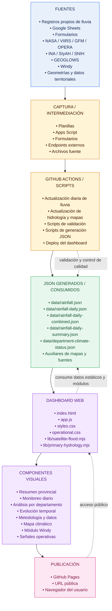

# Workflow de datos y publicación — Precipitaciones y lluvias
Méndez Bautista

## Vista general

Este documento describe el recorrido completo de los datos: desde las fuentes de lluvia, hidrología y territorio hasta su transformación en archivos JSON, visualización en el dashboard y publicación pública.

> Para visualizar el gráfico sin depender de un visor compatible con Mermaid, abrir [WORKFLOW.html](WORKFLOW.html) en un navegador.

## Descripción ejecutiva

El dashboard actual se conforma mediante un flujo de fuentes internas y externas que son procesadas por scripts y GitHub Actions. El resultado de esos procesos son archivos JSON almacenados en el repositorio, que luego son consumidos por el frontend del dashboard publicado en GitHub Pages.

Las principales fuentes son registros propios de lluvia, Google Sheets y formularios, APIs hidrométricas como INA/SIyAH/SNIH, productos satelitales NASA/VIIRS/GFM/OPERA, modelos hidrológicos y el módulo meteorológico externo Windy.

Los JSON centrales son:

- `rainfall.json`: base mensual histórica.
- `rainfall-daily.json` y `rainfall-daily-combined.json`: operación diaria.
- `rainfall-daily-summary.json`: metadata de actualización.
- `department-climate-status.json`: estados derivados por departamento.

El frontend se compone de `index.html`, `app.js`, archivos CSS y módulos auxiliares. Desde allí se renderizan las pestañas del dashboard, el mapa climático, las capas de lluvia, hidrometría, satélite y modelos, además de las señales operativas.

## Diagrama de arquitectura



## Capas del workflow

### 1. Fuentes

Conjunto de orígenes que aportan observaciones, pronósticos, indicadores hidrológicos, imágenes satelitales o información territorial.

| Grupo | Fuentes |
|---|---|
| Observaciones propias | Registros propios de lluvia |
| Captura colaborativa | Google Sheets, formularios |
| Observación satelital | NASA, VIIRS, GFM, OPERA |
| Hidrología institucional | INA, SIyAH, SNIH |
| Modelos hidrológicos | GEOGLOWS |
| Pronóstico y contexto meteorológico | Windy |
| Referencia espacial | Geometrías y datos territoriales |

### 2. Captura e intermediación

Esta capa recibe los datos, los concentra y los deja disponibles para los procesos automáticos. Puede incluir entradas manuales, automatizadas o provenientes de servicios externos.

- Planillas y archivos fuente.
- Formularios de carga.
- Apps Script para automatización o sincronización.
- Endpoints externos para consultas de servicios.

### 3. Automatización y procesamiento

GitHub Actions y scripts ejecutan las tareas recurrentes del sistema:

- Actualizar datos diarios de lluvia.
- Actualizar fuentes hidrológicas y cartográficas.
- Validar estructura, consistencia y disponibilidad de datos.
- Generar archivos JSON normalizados.
- Publicar una nueva versión del dashboard en GitHub Pages.

### 4. Capa de datos JSON

Los archivos JSON funcionan como contrato de intercambio entre los procesos de actualización y el dashboard web.

| Archivo | Uso esperado |
|---|---|
| `data/rainfall.json` | Base mensual histórica de lluvia |
| `data/rainfall-daily.json` | Datos para la operación diaria |
| `data/rainfall-daily-combined.json` | Datos diarios combinados para la operación diaria |
| `data/rainfall-daily-summary.json` | Metadata y estado de actualización |
| `data/department-climate-status.json` | Estados climáticos derivados por departamento |
| Auxiliares de mapas y fuentes | Geometrías, metadatos e información complementaria |

### 5. Dashboard web

La aplicación web consume los JSON generados y los transforma en una interfaz operativa.

| Archivo o módulo | Responsabilidad |
|---|---|
| `index.html` | Estructura principal de la aplicación |
| `app.js` | Lógica de interacción, carga de datos y renderizado |
| `styles.css` | Estilos generales del dashboard |
| `operational.css` | Estilos de la interfaz y señales operativas |
| `lib/satellite-flood.mjs` | Capas y funcionalidad vinculada con satélites e inundaciones |
| `lib/primary-hydrology.mjs` | Capas y funcionalidad vinculada con hidrometría e hidrología primaria |

Desde esta capa se renderizan las pestañas del dashboard, el mapa climático y las capas de lluvia, hidrometría, satélite y modelos hidrológicos, junto con las señales operativas.

### 6. Componentes visuales

El dashboard organiza la información en módulos orientados a consulta y operación:

- **Resumen provincial:** panorama consolidado del territorio.
- **Monitoreo diario:** seguimiento de las precipitaciones recientes.
- **Análisis por departamento:** detalle territorial y comparación entre departamentos.
- **Evolución temporal:** series, tendencias y acumulados.
- **Metodología y datos:** explicación de fuentes, tratamiento y limitaciones.
- **Mapa climático:** representación espacial de indicadores climáticos.
- **Módulo Windy:** consulta del contexto meteorológico y pronósticos.
- **Señales operativas:** indicadores para priorizar atención o seguimiento.

### 7. Publicación

La versión procesada del dashboard se despliega en GitHub Pages y queda disponible mediante una URL pública para su consulta desde el navegador del usuario.

## Flujo operativo resumido

```text
Fuentes
  ↓
Captura e intermediación
  ↓
GitHub Actions y scripts
  ├─ Validación
  ├─ Normalización
  ├─ Generación de JSON
  └─ Deploy
  ↓
Archivos JSON
  ↓
Dashboard web
  ↓
Componentes visuales
  ↓
GitHub Pages → URL pública → Navegador del usuario
```

## Responsabilidades y puntos de control

| Etapa | Entrada principal | Salida principal | Control recomendado |
|---|---|---|---|
| Fuentes | Mediciones, modelos, mapas y registros | Datos disponibles para captura | Disponibilidad y fecha de actualización |
| Captura | Planillas, formularios, endpoints y archivos | Datos reunidos | Campos obligatorios, formatos y duplicados |
| Procesamiento | Datos capturados | Datos validados y normalizados | Errores de ejecución y trazabilidad |
| Generación JSON | Datos procesados | Archivos consumibles | JSON válido, esquema y cobertura temporal |
| Dashboard | Archivos JSON y módulos | Vistas interactivas | Carga, estados vacíos y errores de fuente |
| Publicación | Build validada | URL pública | Deploy exitoso y disponibilidad externa |

## Cadena de valor del dato

**Observar → Capturar → Validar → Normalizar → Publicar datos → Visualizar → Operar**

La separación entre procesamiento, archivos JSON y dashboard permite actualizar las fuentes sin modificar necesariamente la interfaz, y revisar los datos generados antes de exponerlos públicamente.
